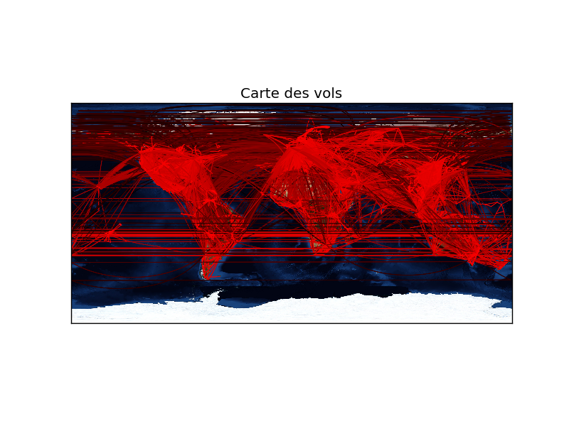

---
title: Rapport projet Open Data Python
author: Romain GILLE, Valentine BORIE
date: \today
...

# Introduction

Dans ce projet, nous avions à réaliser un programme permettant de récupérer des
données et les analyser en créant un histogramme et une carte du monde
permettant un affichage graphique de ces données.

Nous avons choisi le thème des aéroports avec les données présentes
[dans ce Github](https://github.com/jpatokal/openflights/tree/master/data).

Ces données vont nous permettre de faire un histogramme des nombres de vols en
fonction des distances orthodromiques entre deux aéroports. La carte du monde,
représentera les différents trajets des avions que l'on colorera différemment
suivant la distance parcourue.

\newpage

# Histogramme

Nous avons créé cet histogramme représentant le nombre de vols en fonction de
la distance parcourue.

On observe que plus le trajet est long, moins il y a de vols. Pour calculer
ces distances, nous avons calculé la distance orthodromique entre les deux
aéroports. La distance orthodromique correspond à la distance en suivant la
courbure de la Terre.

\newpage

# Carte du monde

Sur cette carte des vols, nous pouvons observer une grande quantité de vols.
Les couleurs représentent la distance de parcours du vol : plus le trajet est
long, plus le trait est rouge, plus il est court, plus il est noir. Les lignes
droites que nous observons correspondent à la courbure de la Terre.