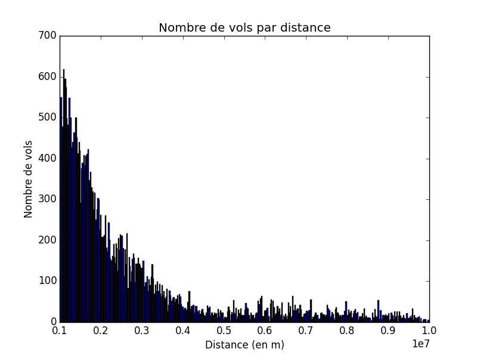

---
title: Rapport projet Open Data Python
author: Romain GILLE, Valentine Borie
date: \today
geometry: margin=1in
...

# Introduction

Dans ce projet, nous avions à réaliser un programme permettant de récupérer des
données et les analyser en créant un histogramme et une carte du monde
permettant un affichage graphique de ces données.

Nous avons choisis le thème des aéroports avec les données présentes
[dans ce Github](https://github.com/jpatokal/openflights/tree/master/data).

Ces données vont nous permettre de faire un histogramme des nombres de vols en
fonction des distances orthodromiques entre deux aéroports. La carte du monde,
représentera les différents trajet des avions que l'on colorera différemment
suivant le pays de départ.

# Histogramme

# Carte du monde
